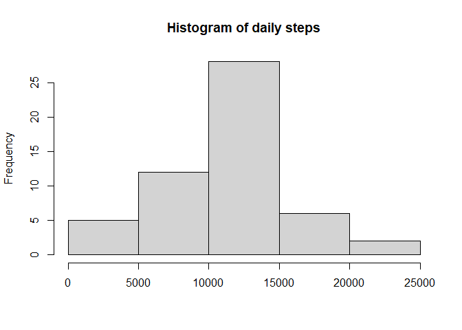

## Loading and preprocessing the data

    library(dplyr)
    library(lattice)
    data <- read.csv("activity.csv")

## What is mean total number of steps taken per day?

    data1 <- data %>% group_by(date) %>% summarise(steps=sum(steps))
    hist(data1$steps, main="Histogram of daily steps", xlab="")

\#\#\# The mean and median of the total number of steps taken per day
is:

    summary(data1$steps)

    ##    Min. 1st Qu.  Median    Mean 3rd Qu.    Max.    NA's 
    ##      41    8841   10765   10766   13294   21194       8

## What is the average daily activity pattern?

    data2 <- data %>% group_by(interval) %>% summarise(steps=mean(steps, na.rm=TRUE))
    data2$time <- lapply(data2$interval, function(x){return (paste(as.character(x%/%100), as.character(x%%100), sep=":"))})
    data2$time <- strptime(data2$time, format="%H:%M")

    plot(data2$time, data2$steps, type="n", xlab="", ylab="Steps", main="Average daily activity pattern")
    lines(data2$time, data2$steps)

### The interval that contains the maximum number of steps, on average, is:

    print((data2 %>% filter(data2$steps == max(data2$steps)))$interval)

    ## [1] 835

## Imputing missing values

### The total number of missing values in the dataset is:

    summary(is.na(data$steps))

    ##    Mode   FALSE    TRUE 
    ## logical   15264    2304

### I created a new dataset filling the NAs with the mean for the 5 minute interval

    data3<-data
    data3$steps <- invisible(sapply(seq_along(data$steps), function(x){
      if(is.na(data[x,1])){
        return (pull(data2[data[x, 3]==data2$interval, 2]))
      }else{
        return (data[x,1])
      }
    }))

### These are the histogram and the mean and median total number of steps taken per day. The values are similar.

    data32 <- data3 %>% group_by(date) %>% summarise(steps=sum(steps))
    hist(data32$steps, main="Histogram of daily steps", xlab="")

    summary(data32$steps)

    ##    Min. 1st Qu.  Median    Mean 3rd Qu.    Max. 
    ##      41    9819   10766   10766   12811   21194

## Are there differences in activity patterns between weekdays and weekends?

    data4 <- data3
    data4$time <- sapply(data4$interval, function(x){return (paste(as.character(x%/%100), as.character(x%%100), sep=":"))})
    data4$fulltime <- paste(data4$date, data4$time)
    data4$fulldate <- strptime(data4$fulltime, format="%Y-%m-%d %H:%M")
    data4$dayOfTheWeek <- weekdays(data4$fulldate)
    data4$dayOfTheWeek <- sapply(data4$dayOfTheWeek, function(x){return (ifelse(x=="sábado" | x=="domingo", "weekend", "weekday"))})
    data4$dayOfTheWeek <- factor(x=data4$dayOfTheWeek, levels=c("weekday", "weekend"), labels=c("weekday", "weekend"))
    data4 <- data4 %>% group_by(dayOfTheWeek, interval) %>% summarise(steps=sum(steps)) 

    xyplot(steps ~ interval | dayOfTheWeek, data=data4, type="l")

